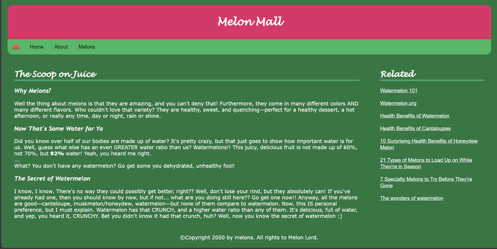
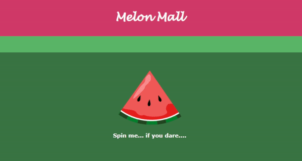

# Melon Mall Website 🍉

A "for fun" website dedicated to the celebration of melons and all they have to offer. Built
with HTML, CSS, and JavaScript.

## Features

### Learn! 📑


### Eat! 😋


### Get Your Melon Fortune! If You Dare.. 🥠


### And Most Of All, Thank the Melon Lord! 🪨


## How to Access

1. Clone the repository:
   ```
   git clone https://github.com/mctripp10/melon-mall.git
   ```

2. Navigate to the project directory and open `home.html` (or whatever page you'd like to start on)
